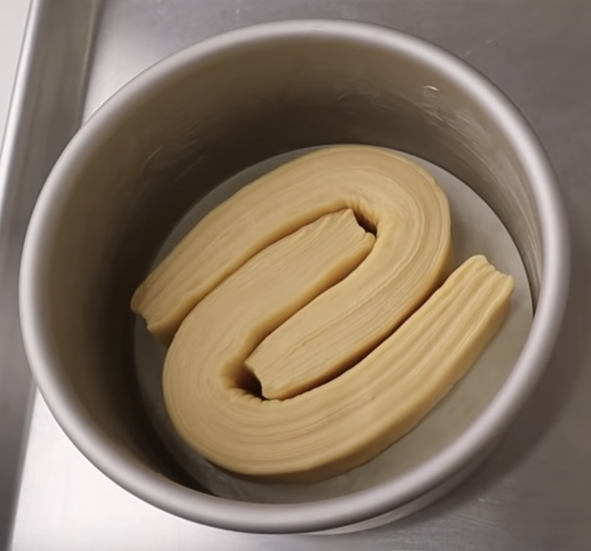

<iframe width="560" height="315" src="https://www.youtube.com/embed/g9rtAvEXfVc" title="YouTube video player" frameborder="0" allow="accelerometer; autoplay; clipboard-write; encrypted-media; gyroscope; picture-in-picture" allowfullscreen></iframe>

<iframe width="560" height="315" src="https://www.youtube.com/embed/TBBikR5jK3E" title="YouTube video player" frameborder="0" allow="accelerometer; autoplay; clipboard-write; encrypted-media; gyroscope; picture-in-picture" allowfullscreen></iframe>

## Ingredients

- Lait: 150g
- Sucre: 45g
- Sel: 2g
- Farine forte: 300g
- Beurre: 30g
- Levure seche: 5g
- Oeuf: 1
- Beurre pour tourage: 120g

## Methode

1. Tout mettre au sauf beurre au robot vitesse 1 jusqu'a developer le gluten.
1. Ajouter 30g de beurre et melanger jusqu'a integration.
1. Couvrir et mettre au frigo 30 minutes.
1. Preparer 120g de beurre dans du papier sulfu 20x20cm
1. Envelopper le beurrer dans la detrempe a 20x40cm.
1. Etaler sur 3-4mm en gardant un coté a 20cm.
1. Tour double. Frigo 20 minutes.
1. Etaler sur 3-4mm en gardant un coté a 20cm.
1. Tour simple. Frigo 20 minutes.
1. Etaler 25x15cm.
1. Couper en 4 bandes et mettre dans le moule beurré.
1. Entrelacer dans le moule.

   
1. Laisser lever 2-3h a 25-27c.
1. Cuisson ventilée à 170c 22 minutes. Puis 200c à 5 minutes.
1. Sortir et appliquer sirop ou beurre fondu au pinceau.
1. Laisser refroidir avant de demouler.
